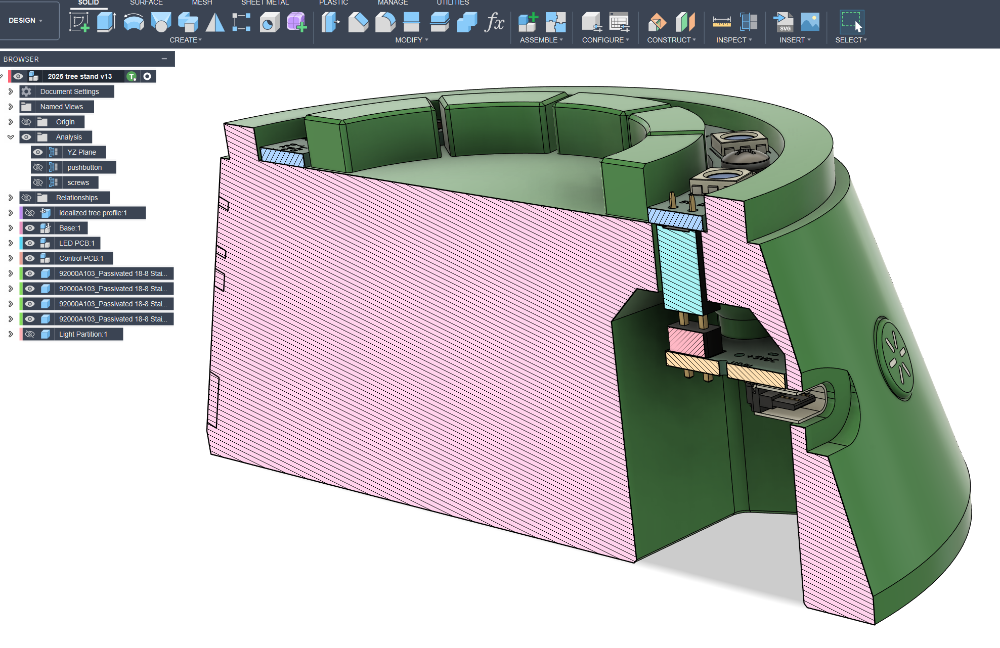
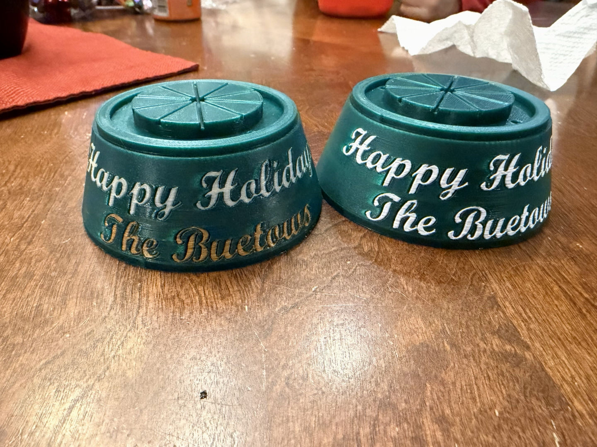
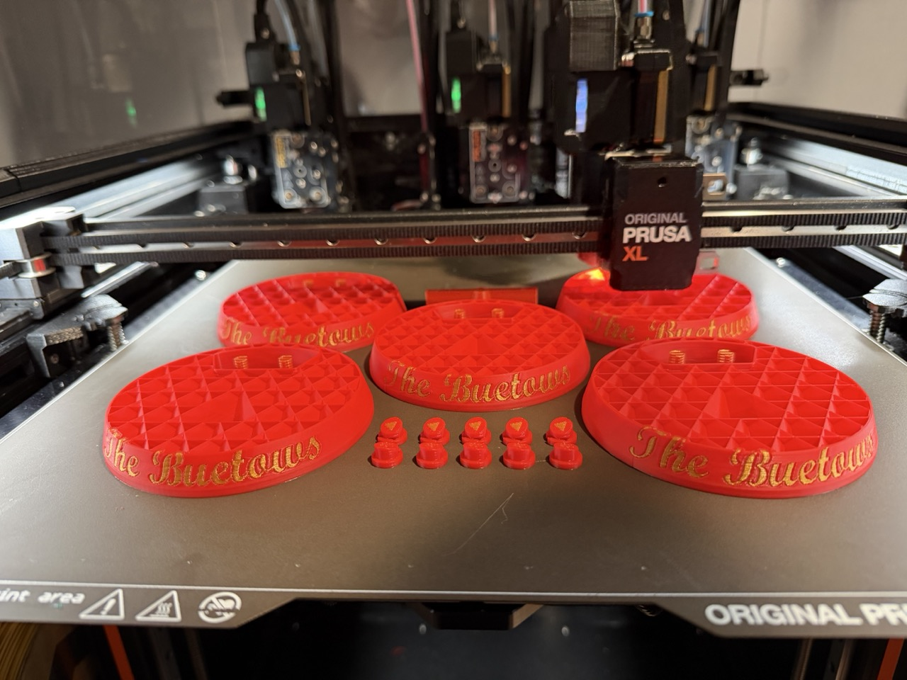
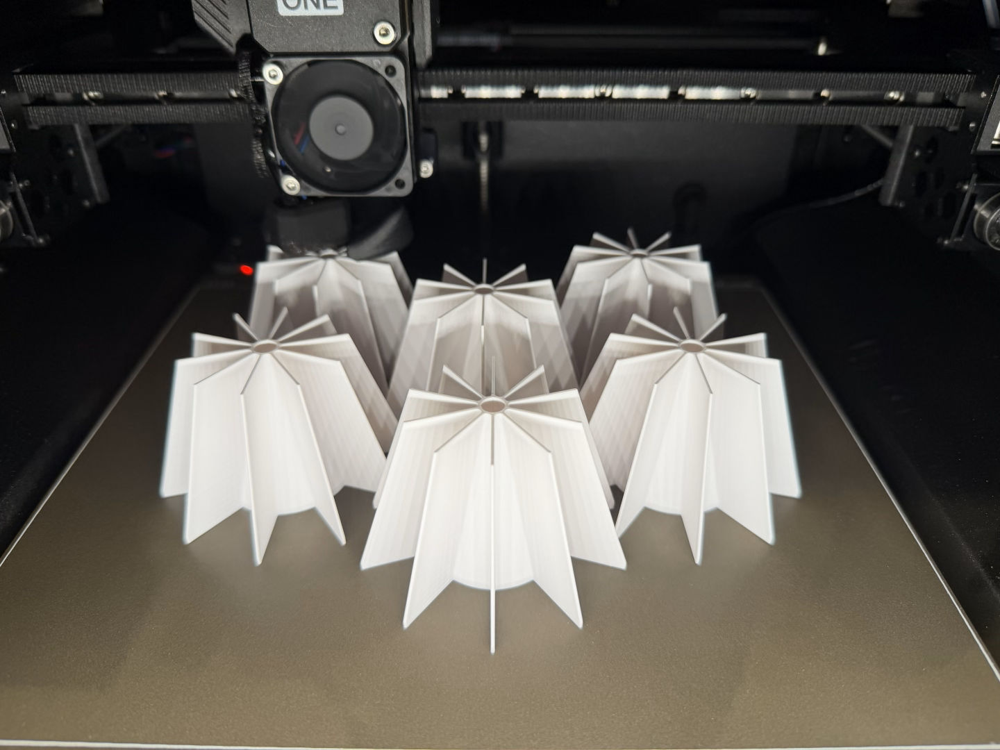
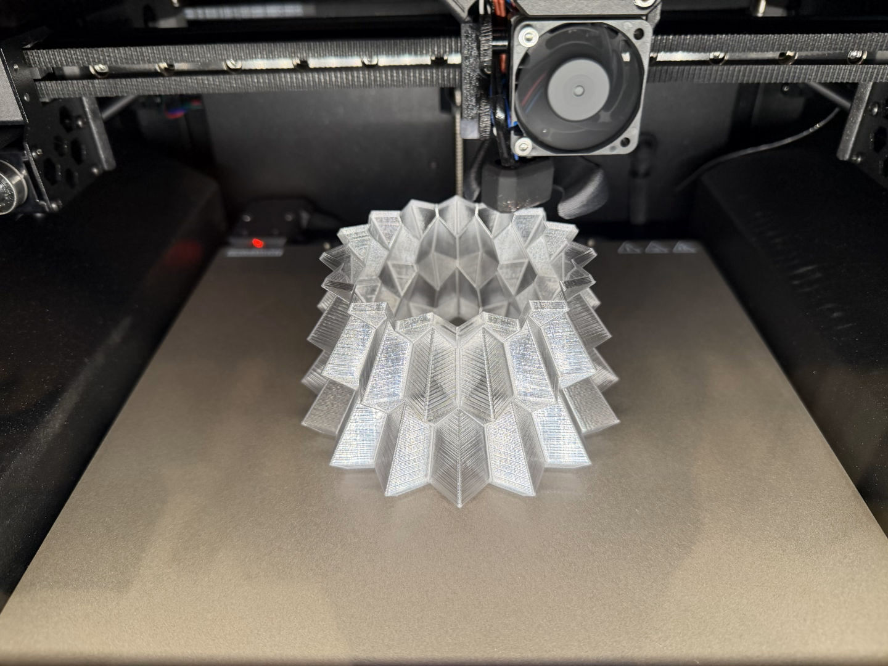
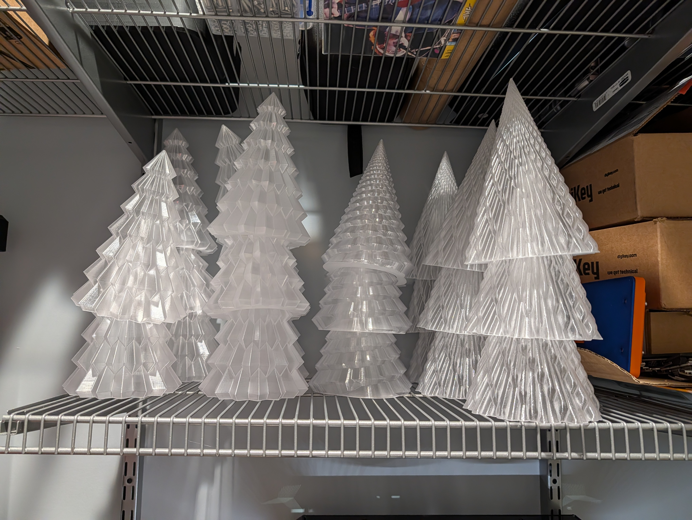
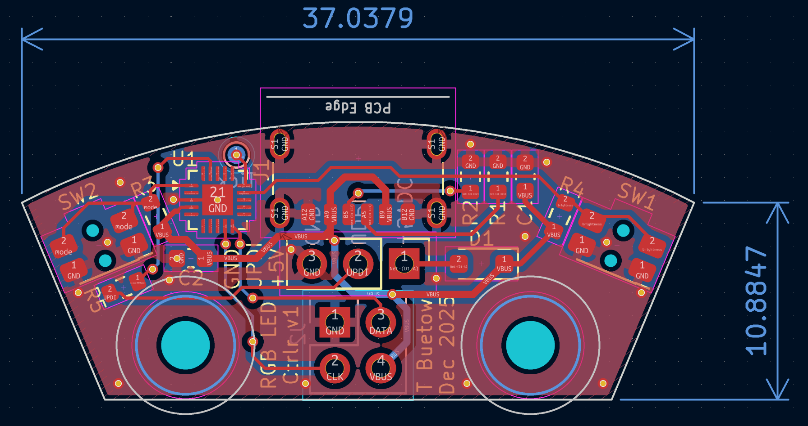
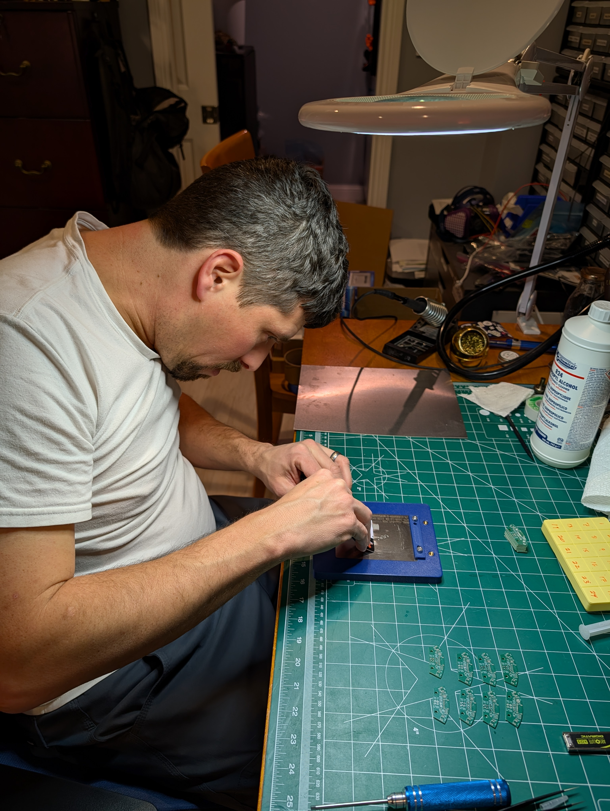
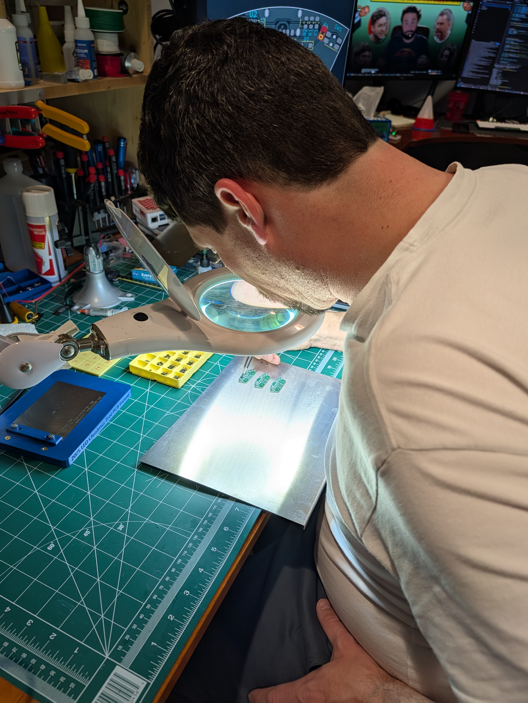
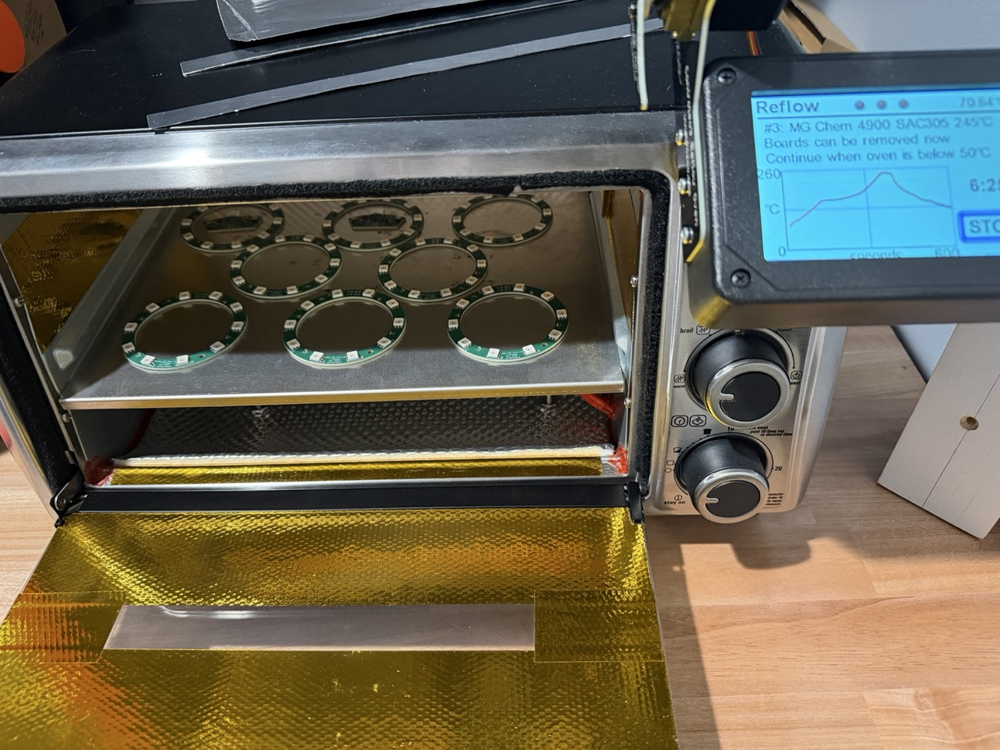

# 🎄RGB LED Christmas Trees! <!-- omit in toc -->

- [How We Made These](#how-we-made-these)
  - [3D Printed Parts](#3d-printed-parts)
    - [Base](#base)
    - [Trees](#trees)
    - [PCB Fixture](#pcb-fixture)
  - [Circuit Boards](#circuit-boards)
  - [Software](#software)
  - [Putting it all together](#putting-it-all-together)
- [Building your own effects](#building-your-own-effects)
  - [Prerequisites](#prerequisites)
  - [VSCode / PlatformIO](#vscode--platformio)
  - [Writing effects](#writing-effects)
  

Each year, I make a small holiday bauble for teachers, family, and friends. Usually my wife and I come up with an idea around Thanksgiving and then panic for three weeks to deliver something by the last day of school for the holidays.

This year we chose to revisit something we made 7 years ago, but improve on it, building on some of my more recent projects with addressable RGB LEDs and better tools like my multiple extruder 3D printer and solder reflow oven.

The concept is a clear thin 3D printed tree on top of a 3D printed base that powers LEDs inside of it. 7 years ago, this was a pair of AA batteries, a single discrete color changing LED, and a power switch. You could also run it off of a 5V supply via micro-USB. Times have changed now! I had a few simple improvements I wanted to make.

- USB-C with proper support for all USB-C power supplies. I chose to drop batteries just due to cost.
- A ring of addressable RGB LEDs instead of a single unmodifiable color changing LED.
- The ability to change the LED color effects, and provide many included options.
- Multiple color printing to make it more beautiful.
- Under $10 and very easy to manufacture, since we want to make 30-40 of these.
- Document the process to share with others and allow those who are inclined to write their own color effects.

# How We Made These
## 3D Printed Parts
### Base
I designed the base and all other fixtures and accessories (except for the trees) in Autodesk Fusion.

You can download the full model from my [Fusion account](https://a360.co/4piaKZ3) if you want to make modifications yourself. Fusion is free for personal use; get it [here](https://www.autodesk.com/products/fusion-360/overview).

The most likely thing you will want to modify is the embedded text. Just edit the text sketch on the Base component. I've removed the bottom row for the shared model. If you want to add one, add a text to the lower curved line. You will then want to edit the emboss and boundary fill operations immediately after the text in order to ensure the new text is properly embossed.

Printing was done on my Prusa XL and Core One.
I started by testing color combinations:

Once done, I was able to begin producing them multiples at a time:

The light dividers and trees were printed on the Core One. Lots of time starting the next print!

### Trees
I used tree designs that would print well in vase mode since I wanted them to be transparent. See [Trees](hw/Trees/) for more information.

Eventually the trees multiplied. Storing things became a challenge!

### PCB Fixture
I designed and printed a fixture to help with soldering as well, available in [Fixtures](/hw/Fixtures/). The fixture was printed in carbon-fiber reinforced PETG, to help the print maintain flatness. Any similar material, maybe even plain PLA, may be fine. The holes on the left are for M4 heat set inserts, used to hold the clamp in place.

<!-- Insert Fixture Picture here -->

## Circuit Boards
The circuit boards were designed in KiCAD. Thanks to the power of modern microprocessors and addressable LEDs, the circuit is quite simple.

The control board is **very** small, just 37mm (under 1.5") across. This is in part because I can get the new(er) Microchip ATTiny1616 in a VQFN package. These are ordered as bare PCBs and I use solder paste and stencils to set components and then reflow them in my solder oven. Hand soldering these would not be possible! The microprocessor has a 0.4mm (1/64") pitch, which is really tiny! It would be better to switch to slightly larger components and change the microprocessor out for one in a SOIC package or similar if you don't have a reflow oven.

However, I do have one!

You start by spreading solder paste over a thin steel stencil onto the PCB.

Then components are carefully placed onto the board, sitting on the solder paste.

Then they are baked in my reflow oven, converted from a cheap toaster oven. 30 seconds at 473F should do nicely!

Once done, the fixture was used again to do the hand soldering part to add the header pins to connect the two boards together.

## Software
I used PlatformIO in VSCode as my IDE to program the microcontrollers. This works well and makes it easy to import the Arduino framework and FastLED library for quick access to easy-to-use functions and tools.

The bulk of the code came from another project I made where I had LED name plates that were edge-lit with RGB LEDs. I just added a few additional effects. [main.cpp](src/main.cpp) is where the effect implementations live and is available in the [src](src/) folder. Also there is [config.h](src/config.h) that contains all the "user" changeable parameters that I broke out. This made it easy to tune the effects to get them to look the way I wanted.

One of the new techniques I made is called Holiday Noise. It uses Perlin Noise to shift between red, green, and white colors. You can learn more about the 2D Perlin Noise in FastLED (one of the dimensions is time!) the same way I did by watching [this YouTube video by Scott Marley](https://youtu.be/7Dhh0IMSI4Q?t=266).

## Putting it all together
The base is designed to print with only minimal support (see the 3mf core one or XL files in [Base Hardware](/hw/Base/)).

Step 1 was to place the buttons and the control board in the bottom. The base was designed to allow it to slide into position, locking the buttons in place. M2.5 screws were used to hold the PCB in place.

Then the LED ring simply installed on the top with two more screws. The header pins lined up precisely to provide the electrical connections between the two boards.

Finished!

# Building your own effects
## Prerequisites
- **Programmer:** You will need a UPDI programmer. You can make one from a USB to serial adapter by just connecting USB Serial RX to the UPDI pin, and then the USB Serial TX to RX with a 1kΩ Resistor. Or you can buy something cheap like the [Adafruit UPDI Friend](https://www.adafruit.com/product/5879) or the High Voltage version too.

- **Jumper wires:** If I installed the 3 male header pins on your board, you will need to adapt the Programmer to 3 0.1" female connectors. The Adafruit one will give you 3 male header pins, so you will need 3 female to female jumpers. Grab [these](https://www.adafruit.com/product/1950) from Adafruit if you are already buying the UPDI Friend, or they are also in [this pack](https://www.amazon.com/Elegoo-EL-CP-004-Multicolored-Breadboard-arduino/dp/B01EV70C78) from Amazon. 

  Programming without the male header is still possible, I just press the programming pins into the holes and push them sideways to ensure electrical contact.

- **VSCode:** You will need an Integrated Development Environment. I use [VSCode](https://code.visualstudio.com/). Within VSCode, you will need the PlatformIO extension. Go to the Extensions tab and search for it within VSCode or grab it from the [extensions marketplace](https://marketplace.visualstudio.com/items?itemName=platformio.platformio-ide).

- **Git:** You probably want to get the [git version control system](https://git-scm.com/) to make it easy to get access to the code. This step is technically optional, but will allow you to undo changes you make at any time.

## VSCode / PlatformIO
1) Install the PlatformIO extension in VSCode. After it finishes, reload VSCode so it can add toolchains the first time you open the project.
1) Clone or download this repo. If you have git, use `git clone` from a terminal. Otherwise use the green "Code" button on GitHub to download a zip, then unzip it somewhere easy to find.
1) In VSCode, go to `File -> Open Folder...` and pick the project root. PlatformIO should notice `platformio.ini` and prompt to install anything it needs—let it run to completion.
1) In the left sidebar, open `platformio.ini` to confirm the `ATtiny1616` environment is selected. Click `src/main.cpp` to browse the effects code and `src/config.h` to tweak tunable values.
1) Hook up your UPDI programmer: UPDI to the single UPDI pin, GND to GND, and 5V to VCC on the control board. I keep the base on its back so the pins are easy to reach.
1) Click the PlatformIO checkmark (Build) to make sure everything compiles, then use the right-facing arrow (Upload using Programmer) to flash the board.

## Writing effects
To write your own effects, you'll need to touch at least two files, ideally 3.

The effects are implemented in [main.cpp](/src/main.cpp). That is where you will do the bulk of the work. Add a case statement to the switch conditional in the loop() function. 

However, the system won't know your effect exists until you add it to the list of states. Go to the [state.h](/src/state.h) file and add it to the Mode class. This class defines the order the effects rotate through when you push the next button on the base.

If you wish to make tuneable variables, it's best practice to add them in [config.h](/src/config.h) but I won't judge you if you just hard code them all in your implementation code.

My effects make use of the `EVERY_N_MILLIS()` timer capabilities in FastLED extensively. This avoids a whole bunch of timer checking code since the people who wrote FastLED are way better at this stuff than I am.

Hopefully that's enough to get you started on your own. Don't be afraid to feed main.cpp to a chatbot and ask it to help you add new effects in the right format. It's a great way to experiment at first. Have fun!
