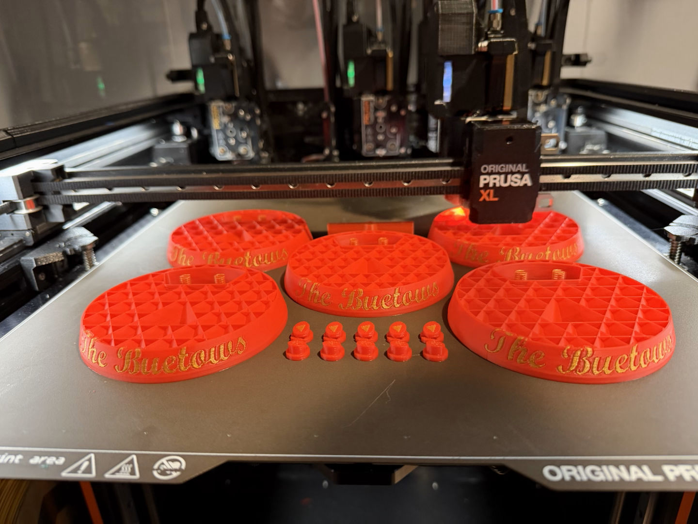

# 🎄RGB LED Christmas Trees!

Each year, I make a small holiday bauble for teachers, family, and friends. Usually my wife and I come up with an idea around Thanksgiving and then panic for three weeks to deliver something by the last day of school for the holidays.

This year we chose to revisit something we made 7 years ago, but improve on it, building on some of my more recent projects with addressable RGB LEDs and better tools like my multiple extruder 3D printer and solder reflow oven.

The concept is a clear thin 3D printed tree on top of a 3D printed base that powers LEDs inside of it. 7 years ago, this was a pair of AA batteries, a single discrete color changing LED, and a power switch. You could also run it off of a 5V supply via micro-USB. Times have changed now! I had a few simple improvements I wanted to make.

- USB-C with proper support for all USB-C power supplies. I chose to drop batteries just due to cost.
- A ring of addressable RGB LEDs instead of a single unmodifiable color changing LED.
- The ability to change the LED color effects, and provide many included options.
- Multiple color printing to make it more beautiful.
- Under $10 and very easy to manufacture, since we want to make 30-40 of these.
- Document the process to share with others and allow those who are inclined to write their one color effects.

## 3D Printed Parts
I designed the base and all other fixtures and accessories, except for the trees in Autodesk Fusion.

Printing was done on my Prusa XL and Core One.
I started by testing color combinations:

Once done, I was able to begin producing them multiples at a time:

The light dividers and trees were printed on the Core One. Lots of time starting the next print!

## Circuit Boards
The circuit boards were designed in KiCAD. Thanks to the power of modern microprocessors and addressable LEDs, the circuit is quite simple.

The control board is **very** small, just 37mm (under 1.5") across. This is in part because I can get the new(er) Microchip ATTiny1616 in a QFN packaged. These are ordered as bare PCBs and I use solder paste and stencils to set components and then reflow them in my solder oven. I would not recommend hand soldering these unless you are very skilled. It would be better to switch to slightly larger components and change the microprocessor out for one in a SOIC package or similar.

<Insert solder oven photo here>

## Software
I used PlatformIO in VSCode as my IDE to program the microcontrollers. This works well and makes it easy to import the Arduino framework and FastLED library for quick access to easy-to-use functions and tools.

The bulk of the code came from another project I made where I had LED name plates that were edge-lit with RGB LEDs. I just added a few additional effects. [main.cpp](src/main.cpp) is available in the [src](src/) folder.

# Building your own effects
## Prerequisites

## VSCode / PlatformIO

## Writing effects
